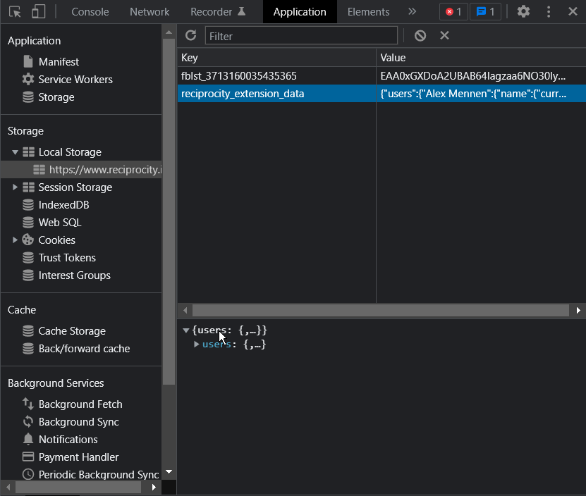

## What this extension does
- Automatically reorders users you've left a check-mark on to just under the last user you "matched" with, or to the top of the list, otherwise
- Automatically reorders new users to show up just below the last user you left a check-mark on, so you don't need to scour the now-hundreds of users to check if anyone new has shown up.  They'll have both a "hide" and "snooze" button.  The "snooze" button keeps them in the top section but below users you've checked.  The "hide" button puts them in the bottom section, under a new separator row.  (Those users will then have an "unhide" button instead, which does the obvious thing.)
- Shows you if someone's updated their bio since you last opened reciprocity by adding a "snooze" button next to the "hide" button (the snooze button goes away when you click on it)

---

## To load this extension
1. Clone this repository (or download it as a zip file, and then unpack it)
2. In Chrome, open `chrome://extensions/` in a new tab.
3. Click `Load Unpacked`, navigate your file explorer to the extension's folder (such that it displays the "inside" - it should have a "build" and "node_modules" folder visible, at a minimum), and click `Select Folder`.
4. Refresh `reciprocity.io` and you should be good to go!

Keep in mind that all of this state is managed via Chrome's localstorage.  If you wipe your localstorage, you'll need to do it all again.  If you want, you can download a copy for safe-keeping by:
1. Opening Chrome's dev console (ctrl+shift+i / cmd+shift+i)
2. Going to the `Application` tab
3. Expanding the `Local Storage` tree in the sidebar's `Storage` section
4. Clicking on `https://www.reciprocity.io`
5. Clicking on the `reciprocity_extension_data` key
6. Right-clicking on the `users` object that shows up in the bottom panel
7. Clicking `Copy Value`
8. Pasting the value that was copied to your clipboard into a file and saving it

Alternatively, here's a screenshot up to step 5:

---

## Developer?

Chrome extensions are pretty annoying.  There's definitely a way to use Typescript with them without everything going into a single file, but all the naive approaches I tried failed for a variety of reasons and I didn't want to bother with the overhead of e.g. Parcel.  There just isn't that much code, and I kept it pretty clean.

Anyways, I built this with Typescript 4.7.4 (as seen in `devDependencies`) but it should work with pretty much anything recent.

If you've never written JS/TS before, you'll want to:
- Install [nvm](https://github.com/nvm-sh/nvm)
- Use that to install the most recent version of Node
- Run `npm install`
- You should now have working type annotations in your favored editor (unless you wrote your own)
- `tsc` or `npm run build` to build before you reload the extension in Chrome for it to pick up your changes